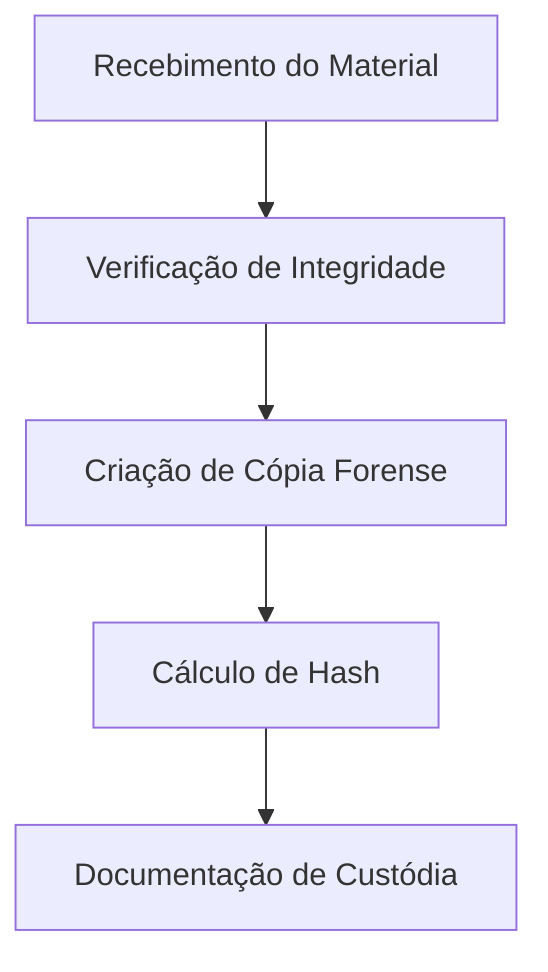
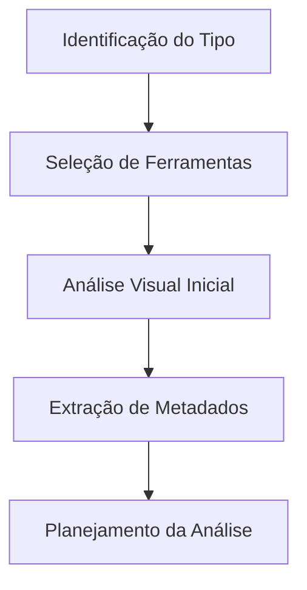
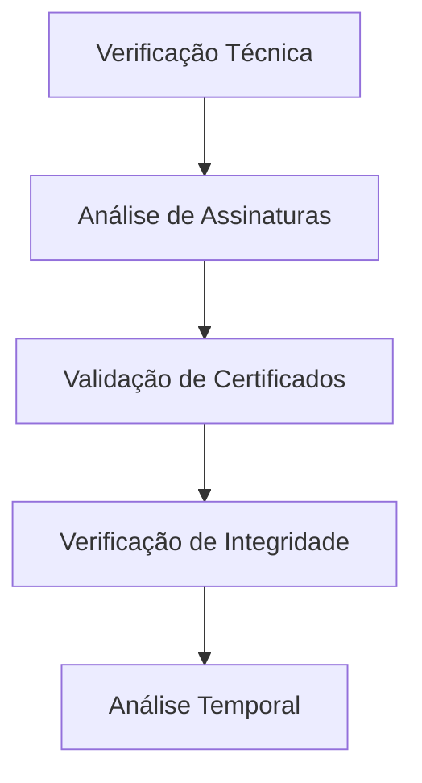
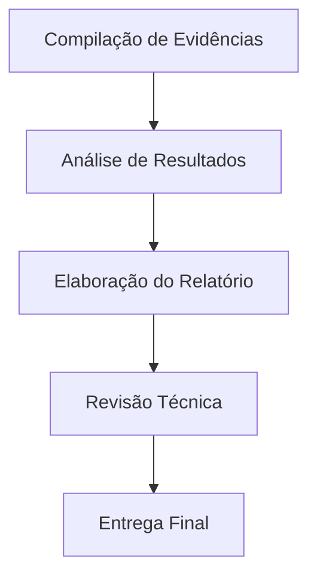

# Metodologia de Análise - Perícia Digital

## 1. Introdução

Esta metodologia estabelece procedimentos sistemáticos para análise forense de documentos digitais, assinaturas eletrônicas e certificados digitais, garantindo:

- **Reprodutibilidade** dos resultados
- **Preservação** das evidências
- **Conformidade** com normas técnicas
- **Rastreabilidade** do processo

---

## 2. Princípios Fundamentais

### 2.1 Preservação da Evidência
- Manutenção da integridade original dos arquivos
- Criação de cópias forenses com hash de verificação
- Documentação completa da cadeia de custódia

### 2.2 Metodologia Científica
- Aplicação de métodos validados e reconhecidos
- Uso de ferramentas certificadas e confiáveis
- Documentação detalhada de todos os procedimentos

### 2.3 Imparcialidade
- Análise técnica objetiva e imparcial
- Apresentação clara de limitações e incertezas
- Separação entre fatos técnicos e interpretações

---

## 3. Fluxo de Trabalho

### Fase 1: Recebimento e Preservação


### Fase 2: Análise Preliminar


### Fase 3: Análise Detalhada


### Fase 4: Documentação e Relatório


---

## 4. Procedimentos Específicos 

### 4.1 Análise de Assinaturas Digitais

#### Verificação de Autenticidade
1. **Extração do Certificado Digital**
   ```bash
   openssl pkcs7 -inform DER -in signature.p7s -print_certs -out cert.pem
   ```

2. **Verificação da Cadeia de Confiança**
   ```bash
   openssl verify -CAfile root_ca.pem -untrusted intermediate.pem cert.pem
   ```

3. **Validação Temporal**
   - Verificar validade no momento da assinatura
   - Confirmar timestamp confiável
   - Checar status de revogação (LCR/OCSP)

#### Verificação de Integridade
1. **Cálculo de Hash**
   ```bash
   openssl dgst -sha256 documento.pdf
   ```

2. **Comparação com Hash da Assinatura**
   - Extrair hash armazenado na assinatura
   - Comparar com hash calculado
   - Documentar qualquer divergência

### 4.2 Análise de Certificados ICP-Brasil

#### Validação Básica
- **Emissor:** Verificar AC credenciada
- **Validade:** Confirmar período de validade
- **Revogação:** Consultar LCR e OCSP
- **Algoritmos:** Verificar conformidade técnica

#### Análise Avançada
- **Políticas de Certificação:** Verificar OID das políticas
- **Extensões Críticas:** Analisar restrições de uso
- **Cadeia Completa:** Validar até raiz ICP-Brasil

### 4.3 Detecção de Alterações

#### Análise de Metadados
```bash
# Extração com ExifTool
exiftool -all documento.pdf

# Análise com PDFtk
pdftk documento.pdf dump_data output metadados.txt
```

#### Verificação de Estrutura
- Análise da estrutura interna do PDF
- Identificação de incrementos suspeitos
- Verificação de objetos modificados

---

## 5. Ferramentas e Software

### 5.1 Ferramentas Primárias

| Ferramenta | Uso Principal | Versão Recomendada |
|------------|---------------|-------------------|
| Adobe Acrobat Pro | Verificação visual e básica | DC ou superior |
| OpenSSL | Análise criptográfica | 1.1.1 ou superior |
| ICP-Brasil Verificador | Validação oficial | Última versão |
| ExifTool | Análise de metadados | 12.0 ou superior |

### 5.2 Ferramentas Auxiliares

| Ferramenta | Finalidade | Observações |
|------------|------------|-------------|
| PDFtk | Manipulação de PDF | Código aberto |
| HxD | Editor hexadecimal | Análise binária |
| Wireshark | Análise de rede | Para validações online |
| 7-Zip | Compressão/extração | Análise de estruturas |

---

## 6. Documentação e Relatórios

### 6.1 Estrutura Padrão do Laudo

1. **Resumo Executivo**
   - Objetivo da perícia
   - Principais conclusões
   - Limitações identificadas

2. **Metodologia Aplicada**
   - Procedimentos utilizados
   - Ferramentas empregadas
   - Normas de referência

3. **Análise Técnica**
   - Evidências coletadas
   - Testes realizados
   - Resultados obtidos

4. **Conclusões**
   - Respostas aos quesitos
   - Fundamentos técnicos
   - Recomendações

### 6.2 Evidências Obrigatórias

#### Para Cada Análise
- **Screenshots** das verificações
- **Logs** completos das ferramentas
- **Certificados** extraídos
- **Hashes** de verificação

#### Metadados Essenciais
- Data e hora da análise
- Versões das ferramentas utilizadas
- Identificação do analista
- Ambiente de análise

---

## 7. Controle de Qualidade

### 7.1 Validação Cruzada
- Uso de múltiplas ferramentas para confirmação
- Verificação independente por segundo analista
- Teste com casos conhecidos (controle positivo/negativo)

### 7.2 Rastreabilidade
- Logs detalhados de todos os procedimentos
- Versionamento de documentos e evidências
- Backup seguro de todos os materiais

### 7.3 Revisão Técnica
- Verificação por perito sênior
- Validação da metodologia aplicada
- Confirmação das conclusões

---

## 8. Normas e Referências {#referencias}

### 8.1 Normas Nacionais
- **MP 2.200-2/2001** - Institui a ICP-Brasil
- **ITI-T 08** - Algoritmos e Parâmetros de Assinatura Digital
- **ABNT NBR ISO/IEC 27037** - Diretrizes para identificação, coleta e preservação de evidência digital

### 8.2 Normas Internacionais
- **RFC 3852** - Cryptographic Message Syntax (CMS)
- **RFC 5652** - Cryptographic Message Syntax (CMS)
- **ISO 14533** - Processes, data elements and documents in electronic signature

### 8.3 Padrões Técnicos
- **ETSI TS 101 733** - Electronic Signatures and Infrastructures
- **PKCS #7** - Cryptographic Message Syntax Standard
- **X.509** - Public Key Infrastructure Certificate

---

## 9. Atualização e Manutenção

### 9.1 Revisão Periódica
- Revisão semestral da metodologia
- Atualização conforme novas normas
- Incorporação de novas ferramentas validadas

### 9.2 Treinamento Contínuo
- Capacitação em novas tecnologias
- Participação em eventos técnicos
- Manutenção de certificações profissionais

### 9.3 Melhoria Contínua
- Análise de casos problemáticos
- Feedback de outros peritos
- Incorporação de lições aprendidas

---

*Esta metodologia é baseada em melhores práticas internacionais e é continuamente atualizada para refletir o estado da arte em perícia digital.*
